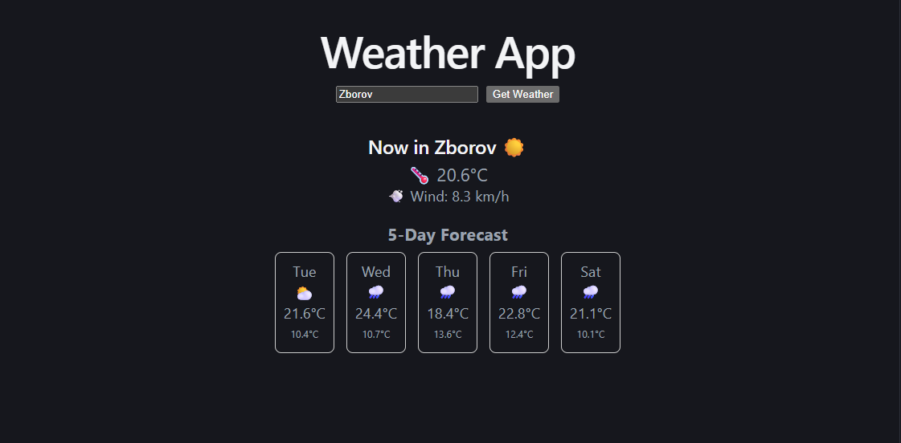

# 🌦️ Weather App (React)

A simple and responsive weather application built with React.  
The app allows users to search for a city and view current weather conditions and a 5-day forecast using the Open-Meteo API.

---

## 🚀 Features

- 🌍 City search with geolocation API
- 🌤️ Current weather display (temperature, wind, weather icon)
- 📅 5-day weather forecast
- ⌨️ Enter key support for search
- ⏳ Loading state during API requests
- ❌ Error handling (empty input, city not found)
- 📱 Responsive layout
- 🎨 Clean UI with flexbox layout

---

## 🛠️ Tech Stack

- React (useState, conditional rendering)
- JavaScript (ES6+)
- Open-Meteo API
- HTML + inline CSS (Flexbox)

---

## 📡 API Used

- Geocoding API:
  https://geocoding-api.open-meteo.com/v1/search

- Weather API:
  https://api.open-meteo.com/v1/forecast

---

## 📷 Preview



---

## 🧠 What I learned

- Working with external APIs in React
- Managing multiple states (loading, error, data)
- Conditional rendering
- UI structuring with Flexbox
- Data mapping for forecast display
- Basic UX improvements (Enter key, loading state)

---

## 🚀 Future improvements

- Weather icons with SVG instead of emojis
- Background changes based on weather
- Save last searched city (localStorage)
- 7-day forecast
- Deployment on Vercel

---

## 🌍 Live Demo

👉 https://weather-app-nine-henna-15.vercel.app/

## ▶️ How to run locally

```bash
git clone https://github.com/samogdovin193-dotcom/weather-app.git
cd weather-app
npm install
npm run dev
```
